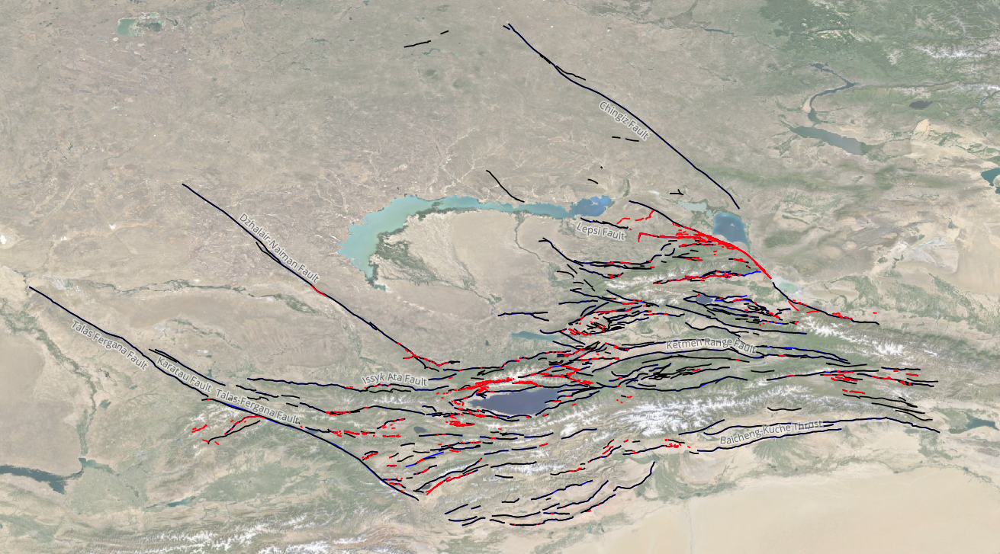

# Tien-Shan-Active-Fault-Database
Tien Shan Active Fault Database is a multi-functional digital collection of active faults which integrates decades of mapping and field studies in Central Asia by researchers from the UK Centre for Observation and Modelling of Earthquakes, Volcanoes and Tectonics (COMET) alongside global collaborators. 

The database compiles active fault traces and metadata at three different scales to serve a variety of purposes that fault databases are conventionally used for: the finest scale for site-specific study reference, an intermediate scale for regional kinematics and seismotectonics, and a coarse scale from which structures may be extracted for geodetic modelling and seismic source models: 
* **Level 1:** Fine-scale mapping of scarps and ruptures (approximately 1:10k scale) 
o	This level includes scarps and vertical/lateral geomorphic offsets mapped from field work, low-altitude imagery/DEMs, or high-resolution satellite or air-photo imagery/DEMs. These represent both historic and pre-historic earthquake ruptures (and potentially secondary features, e.g. Sackungen) that are preserved in the landscape. 
* **Level 2:** Active fault traces recognized geomorphically at a regional scale (approximately 1:50k scale)
o	This level contains representations of through-going faults that may be considered the major structural entities responsible for large-scale deformation of the landscape. These are identified in the landscape through remote-sensing, field mapping, and/or historically documented earthquake ruptures. Gaps and steps in original mapping where they may relate to geometric complexities in faulting are retained, but apparent breaks related to sedimentation or erosion are joined (e.g. across rivers). All lines associated with clear geomorphic indicators of active faulting are retained, regardless of length (e.g. lines <1km are retained). These lines may be based on detailed scarp mapping, but are represented at a coarser scale that may be more practical for regional and structural mapping as well as kinematic and geodetic modelling.
* **Level 3:** ‘Seismic source’ faults
o	This level is a derivative product of Level 2 produced through expert consultation, to represent the major faults that most plausibly represent major stand-alone seismogenic structures. This level is designed to form the basis for regional geodetic strain modelling or ultimately source-based seismic hazard analyses. Gaps, steps, and discontinuities in lines are either joined or retained based on considerations of distance, scale, and structural coherence. Only major structures that based on dimensions could feasibly host an earthquake of Mw > 6.0-6.5 are included. The database is a work-in-progress and we expect future releases to include metadata including fault geometries and rates of motion.

If you’d like to be involved in this work, or be informed of future updates, please contact comet@leeds.ac.uk. 
## Publication
King, T., Elliott, A., Grützner, C., Styron, R., and Walker, R. (2024). The Tien Shan Active Fault Database: a multi-tiered multi-purpose active fault database Scientific Data [IN REVIEW].
## Database
[Zenodo link]

Contact: Through ongoing and future projects, COMET researchers will continue to improve the accuracy of mapped faults and map previously unidentified faults. These will be incorporated into the database on an ad-hoc basis. If any users wish to suggest edits / additions / deletions to the database, please email comet@leeds.ac.uk and it will reach the current database manager. 
## Acknowledgements:
We acknowledge the many students and colleagues that helped during our individual field campaigns. The fault mapping in the field would not have been possible without the support of Kanatbek Abdrakhmatov (Institute of Seismology, Bishkek), Aidyn Mukambayev (KNDC, Almaty), and their colleagues.
Grants that contributed to the work presented in this paper include: Earthquakes without Frontiers project, funded by NERC and ESRC (grant code: EwF_NE/J02001X/1_1); Looking inside the Continents from Space (LiCS) (NE/K011006/1); Leverhulme Trust Research Project Grants “EROICA” (RPG-2018-371); and multiple students funded by the NERC studentship in the Oxford Environmental Research Doctoral Training Partnership. 
Many of the high-resolution photogrammetric datasets from which Level 1 mapping was produced have been made available on OpenTopography (https://portal.opentopography.org/datasets?search=COMET).
